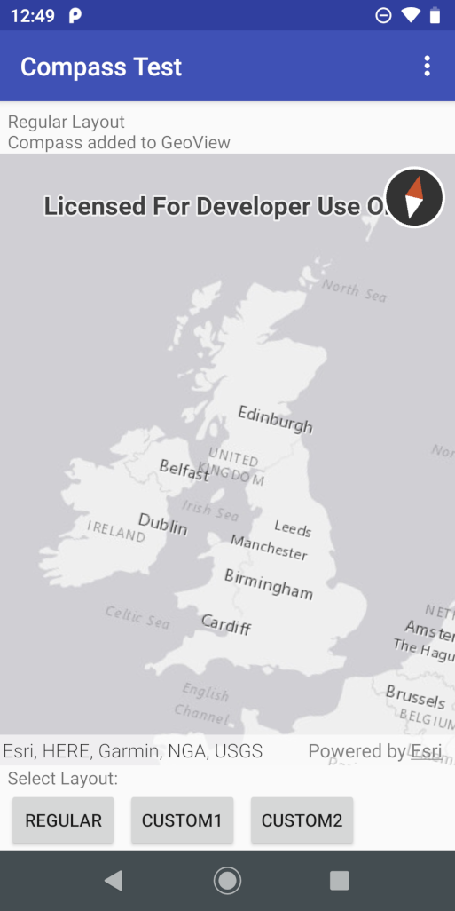
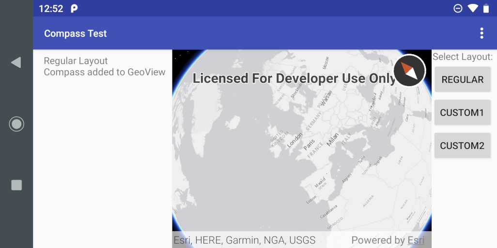
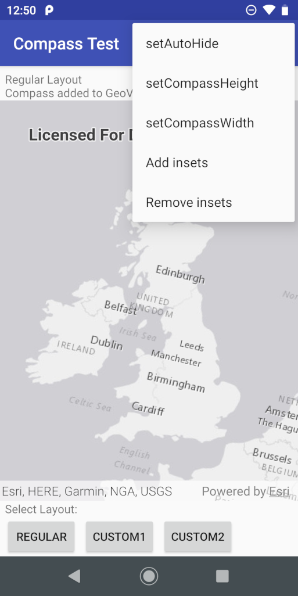

# CompassTestActivity

## Introduction

CompassTestActivity is a test activity for the [`Compass`](./readme.md) toolkit component. It displays a GeoView and allows a Compass for that GeoView to be displayed using a number of different layouts. It also offers a set of menu options to change the attributes of the Compass and modify the GeoView.

## Select MapView or SceneView

On startup the app displays a dialog asking the user to select MapView or SceneView, allowing both types of GeoView to be tested.

## Layout Selection

Once MapView or SceneView has been selected, the app displays 3 buttons that allow different layouts to be selected. Different sets of layouts are used in portrait and landscape orientations, so 6 different layouts are available. The default is termed the Regular Layout.

The layout selection buttons are displayed at the bottom of the screen in portrait orientation and at the right-hand side of the screen in landscape orientation. The buttons are labelled:

* **REGULAR** - This is the default layout and uses Workflow 1 to add a Compass to the GeoView. Initially the Compass uses the default settings, so it is displayed near the top-right corner of the GeoView.
* **CUSTOM1** - This uses Workflow 2 and a layout that defines a Compass that overlays the top-left corner of the GeoView.
* **CUSTOM2** - This uses Workflow 2 and a layout that defines a Compass that's completely outside the GeoView.

Part of the screen is devoted to information display. In portrait orientation it is a strip at the top of the screen, above the GeoView. In landscape orientation it is an area at the left-hand side of the screen. The information consists of a simple message describing which layout is currently displayed and, in CUSTOM2 layout only, the Compass itself.

Here's how the default display looks in portrait orientation when using a MapView:

and in landscape orientation when using a SceneView:

## Change Compass Attributes

To change the attributes of the current Compass, click on the Action Bar overflow to see a menu of options:

The top 3 options correspond with the Compass setter methods. They each invoke a dialog asking the user to specify an attribute value to be set.

## Add and Remove MapView Insets

The bottom 2 options in the Action Bar overflow menu are *Add insets* and *Remove insets*. These have an effect only when MapView was selected on startup and the Regular layout is displayed. Adding insets on the Regular layout causes yellow inset views to be displayed on all 4 sides of the MapView. These cause the Compass to be moved to ensure it's always in the visible part of the MapView. Removing the insets causes the Compass to move back again.
