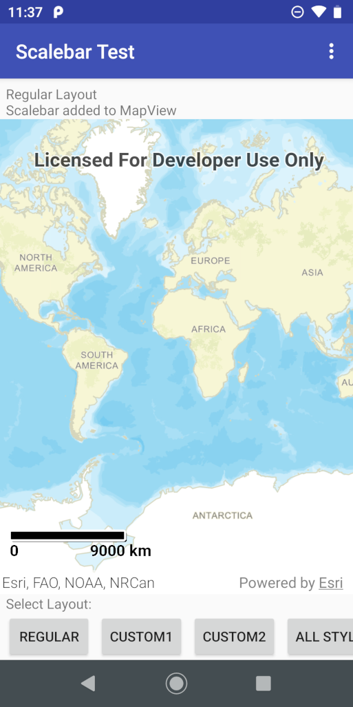
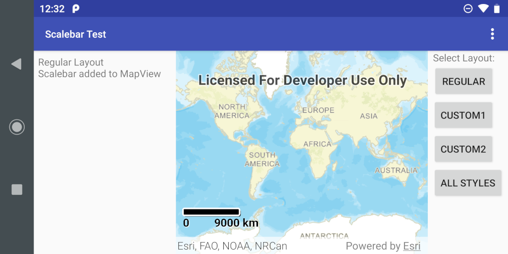
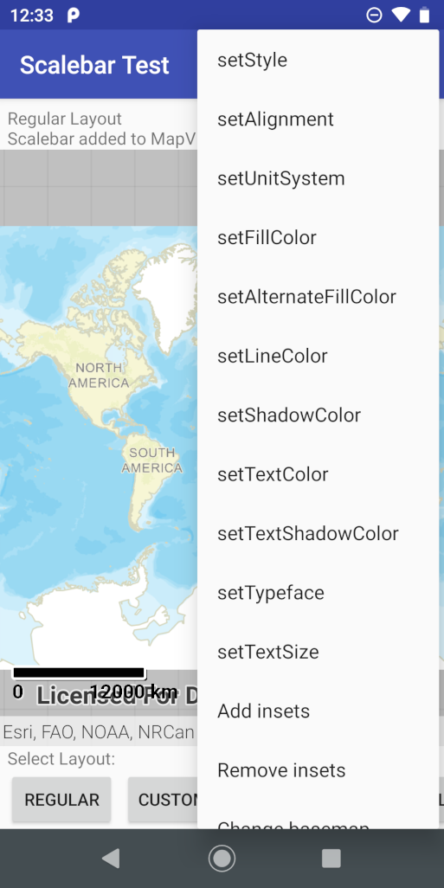
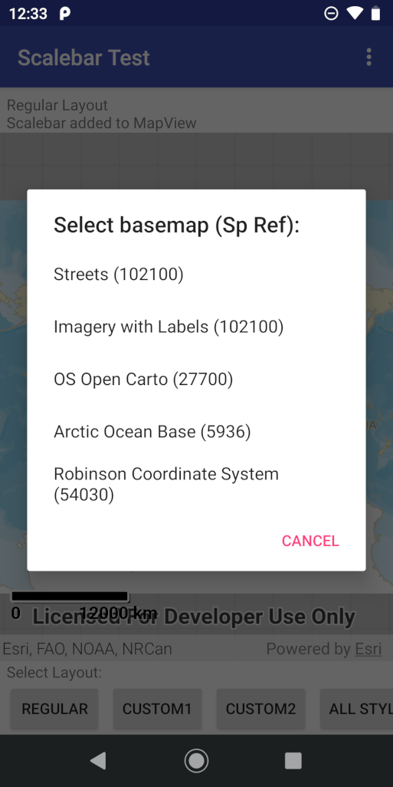

# ScalebarTestActivity

## Introduction

**ScalebarTestActivity** is a test activity for the [`Scalebar`](./readme.md) toolkit component. It displays a `MapView` and allows a `Scalebar` for that `MapView` to be displayed using a number of different layouts. It also offers a set of menu options to change the attributes of the Scalebar and modify the `MapView`.

## Layout Selection

The app displays 3 buttons that allow different layouts to be selected. Different sets of layouts are used in portrait and landscape orientations, so 6 different layouts are available. The default is termed the Regular Layout.

The layout selection buttons are displayed at the bottom of the screen in portrait orientation and at the right-hand side of the screen in landscape orientation. The buttons are labelled:

* **REGULAR** - This is the default layout and uses Workflow 1 to add a Scalebar to the MapView. Initially the Scalebar uses the default settings, so it is displayed near the bottom-left corner of the MapView.
* **CUSTOM1** - This uses Workflow 2 and a layout that defines a Scalebar that overlays the top-left corner of the MapView.
* **CUSTOM2** - This uses Workflow 2 and a layout that defines a Scalebar that's completely outside the MapView.
* **ALL STYLES** - This uses Workflow 2 and a layout that defines all 5 styles of Scalebar on top of the MapView.

Part of the screen is devoted to information display. In portrait orientation it is a strip at the top of the screen, above the MapView. In landscape orientation it is an area at the left-hand side of the screen. The information consists of a simple message describing which layout is currently displayed and, in CUSTOM2 layout only, the Scalebar itself.

Here's how the default display looks in portrait orientation:

and in landscape orientation:

## Changing Scalebar Attributes

To change the attributes of the current Scalebar, click on the Action Bar overflow (not present in the ALL STYLES layout) to see a menu of options:

The top 12 options correspond with the Scalebar setter methods. They each invoke a dialog asking the user to specify an attribute value to be set.

## Adding and Removing MapView Insets

The next 2 options in the Action Bar overflow menu are "Add insets" and "Remove insets". These have an effect only when the Regular layout is displayed. Adding insets on the Regular layout causes yellow inset views to be displayed on all 4 sides of the MapView. These cause the Scalebar to be moved to ensure it's always in the visible part of the MapView. Removing the insets causes the Scalebar to move back again.

## Changing Basemap

The last option in the Action Bar overflow menu is "Change basemap". This offers a choice of 5 basemaps as follows, each with a different spatial reference, so they can be used to show the Scalebar can handle different projections:

